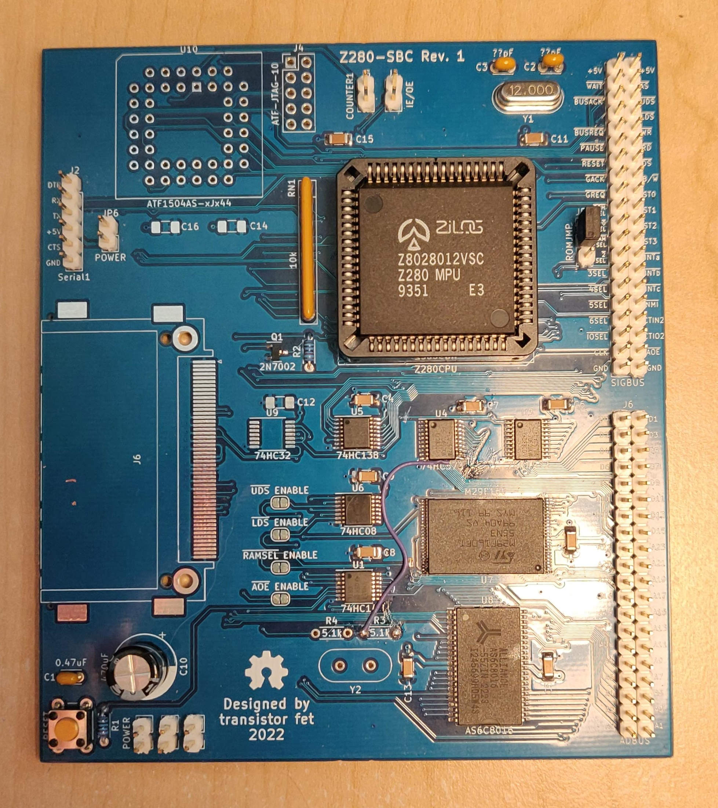
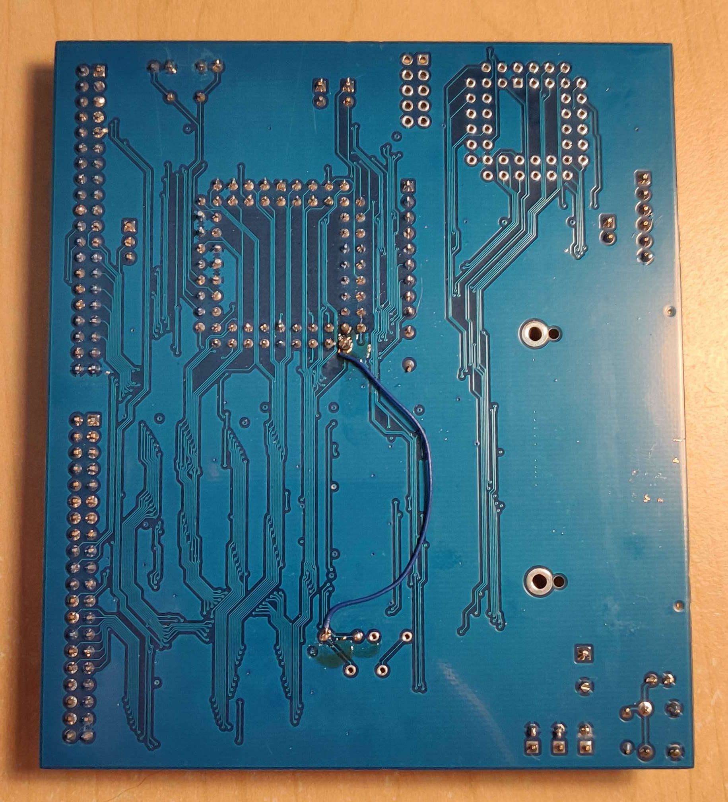
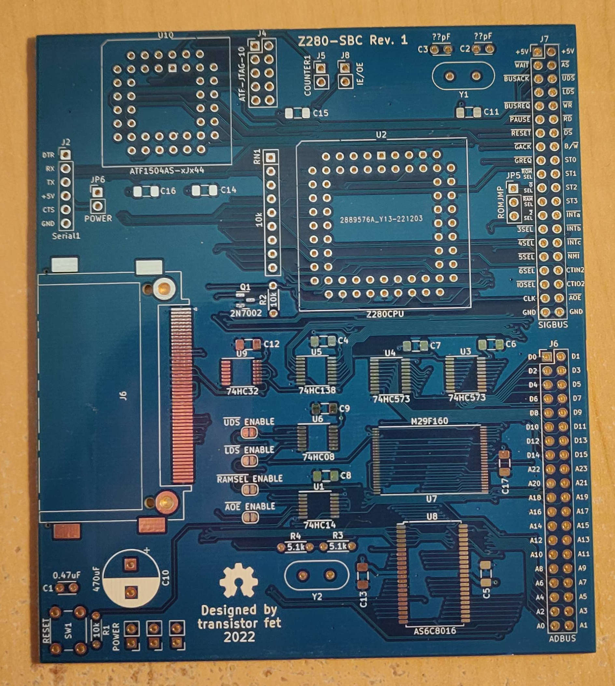

Z280 Computer
=============

###### *Started October 29, 2022*

A [series of] computers using the Z280, similar to the [Computie
project](https://jabberwocky.ca/projects/computie/).  The first board is a prototyping board with
the CPU's basic needs (clock/pullup resistors/etc), a 1MB Static RAM, a 1MB Flash chip, plus an
expansion bus that an Arduino can be connected to.  The bus pin assignments match Computie's
Supervisor shield, so the onboard flash chip can be programmed using the same harness as
[Computie](https://github.com/transistorfet/computie/raw/main/hardware/68k-Supervisor).

This repository uses git submodules, and can be cloned using:
```
git clone --recurse-submodules git@github.com:transistorfet/z280.git
```

Z280-SBC Revision 1
-------------------



[Schematics](https://github.com/transistorfet/z280/raw/main/hardware/Z280-SBC/Z280-SBC.pdf)

I designed the first board quickly with the idea of it being rough.  Rather than prototype the CPU
using solderless breadboards, which are prone to electrical faults, I thought I'd design a minimal
board instead, with footprints for various additional components, like memory, a compact flash card
slot, and a CPLD.  I made the mistake of using vias that were 0.4 mm total diameter, which made the
boards more expensive at JLC.  If I redesign the board, I'll probably try to use 0.45 mm vias to
avoid that.

Building the board was pretty quick and easy.  I used the supervisor shield from Computie, along
with the Arduino program
[here](https://github.com/transistorfet/z280/raw/main/software/arduino/Z280Supervisor/) to try to
feed data to the CPU live, without the memory.  I couldn't find documentation on the frequency range
of the CPU, so I used a 12 MHz crystal, which clocks the CPU at 3 MHz.  That's still too fast
though for the Arduino to assert the WAIT signal without an external flip flop to latch it.

I added the memory to the board to see if I could get the CPU executing from there instead, but it
turns out the footprint for the flash chip is upside down, and I installed the chip right way up.  I
didn't notice at first, and while trying to read from the RAM I was getting duplicate numbers in the
test pattern because the A4 address line was being held always low by the flash chip.  The flash
chip was also getting extremely hot when programming the Arduino, but not when idle, oddly enough.
Eventually I clued into the fact that the chip needed to be rotated, and was able to do that using a
hot air rework station to remove the chip.  I reused the same chip, and it seems to work, but there
are other issues with the board, and I'm a bit suspicious of it still.

Using a [logic analyzer](https://www.sparkfun.com/products/18627), I captured some signals after a
reset (I held the reset button while starting a capture and released it during the capture to get
the initial startup).  The bus cycles didn't seem to make sense for the program it should have been
executing, so I programmed the halt instruction into each byte of the first 2K of the flash and ran
it to make sure it halted pretty much right away.  It accessed memory twice before halting instead
of just once, but that might be the instruction pre-fetch (not sure yet).

I was able to use the /DS line wired to the /WAIT line to pause the CPU on the first instruction,
and then inspect the address and data buses at that point, mid bus cycle.  The address bus had the
halt instruction (0x76) on the lower byte, as did the data bus.  The lower address and data buses
are multiplexed on this CPU, and the external latches are supposed to save the address portion when
/AS is low and output them on dedicated address lines wired to the separate address pins of the
memory chips.  Since this was just after a reset, it should have been accessing address 0x0000.  The
address demultiplexing latches should have taken care of this, but it was as if they were open all
the time.  Well, I got the logic backwards on the latch enable pin, so it was was latching when the
/AS line *wasn't* asserted (low).  I must have thought it was negative logic instead of positive
logic, because the /OE pin on the same chip to enable the output is negative logic.

I was able to use one of the inverter gates for the backup clock, which wasn't populated yet, to
invert the /AS line before going into the latch enable pin (positive-logic).  That fixed the
latching issue, and it seems to execute code now, but I can't get much visibility into it yet.

I looked at the ST0-ST3 signals in particular, which output a number corresponding to the
transaction type during each bus cycle.  It seems to be running as expected, accessing memory either
cacheable (0x8) or non-cacheable (0x9), and refreshing memory (0x1).  When the CPU halts, it issues
a halt bus cycle (0x3) and then only performs refresh cycles after that.

I tried adding an EPU instruction, which is a custom Z280 instruction for accessing a coprocessor.
It uses its own transaction type, 0xD for the first word, and 0xC for all subsequent words.  Writing
that instruction into the ROM produced those codes, so it's definitely executing code.  It seemed to
sometimes halt too early though, which turned out to be the attempt at configuring the MMU.  If
there's a problem with the page table that's loaded once the MMU is enabled, it will cause "the
fatal condition" to occur, which halts the CPU.  I had a number of mistakes in the code, and the Z80
assembler I was using was producing some incorrect code.  I switched to SDCC's assembler, which
produces correct code and correct byte orders, and the MMU can now be initialized without 

With that, I set about configuring the UART according to the [Z280 Technical
Manual](https://oldcomputers.dyndns.org/public/pub/rechner/zilog/z280/manual/index.html), which also
requires Timer1 to be configured.  It worked without much trouble, and I was able to print a message
to a serial terminal.

I will need to make a more capable monitor to write to flash so that I can load and jump to code in
RAM instead so I don't need to flash the arduino and then flash the onboard chip.  I can instead
load the data over the serial terminal into ram and run it, the way I can with Computie68k.






