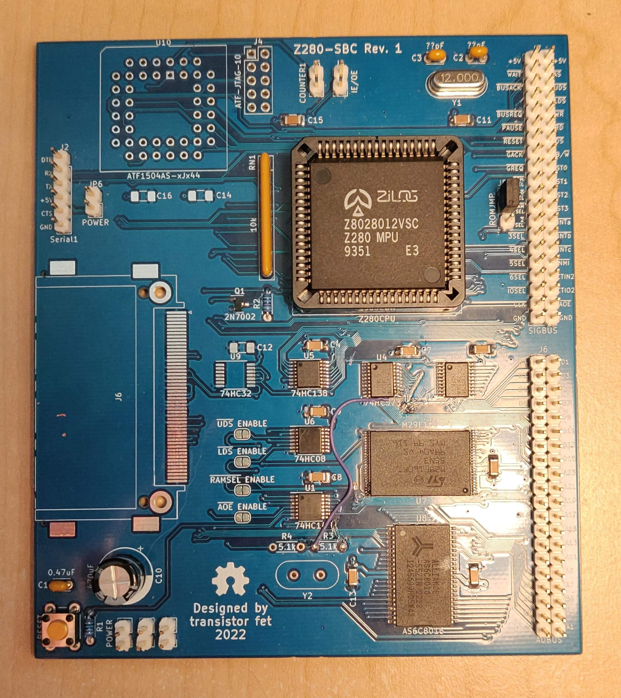
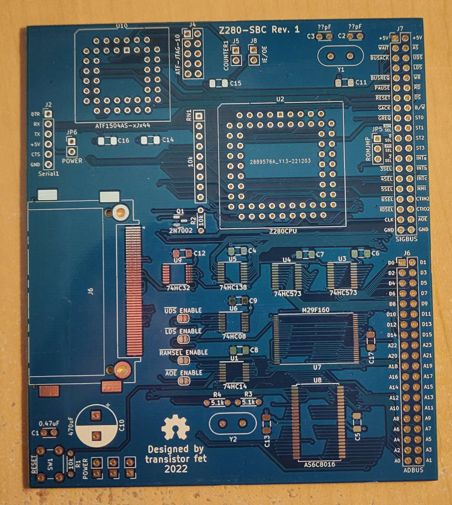

Z280-SBC
========

Status: DO NOT BUILD (see errata)

Latest: Rev.1

### About
A single board computer with a Z280 CPU, 1MB of static RAM, and 1MB of Flash.

This board has a number of issues described in the errata, which require reworking the board.  The
flash chip needs to be upside down, and the address selection latch's operation is backwards and
needs an extra inverter gate, it or won't run code.  Also, the serial port cannot function correctly
without an external clock circuit to directly supply the UART clock because driving it indirectly
with the Z280's timer causes frequent clock glitches resulting in invalid characters being
sent/received.

[Revision 1 Notes & Errata](revisions/Z280-SBC-rev1-errata.txt)

[Revision 1 Schematic](revisions/Z280-SBC-rev1.pdf)

[Revision 1 Gerbers](revisions/Z280-SBC-rev1.zip)

